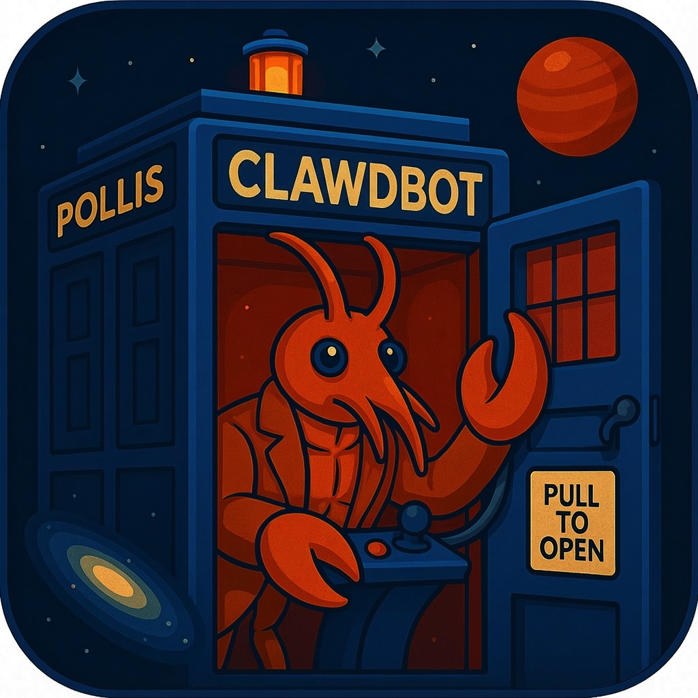

# 🍀 Paddy — Your Agentic Irish Assistant

<p align="center">
    <picture>
        
    </picture>
</p>

<p align="center">
  <strong>Paddy's Hearth — Built for Ciaran Cox</strong>
</p>

<p align="center">
  <a href="https://github.com/blueray32/paddy-bot/actions"></a>
  <a href="LICENSE"></a>
</p>

**Paddy** is a _personal AI assistant_ running on Ciaran's local infrastructure.
It answers on the channels we use daily (WhatsApp, Telegram, Slack, Discord, Google Chat, Signal, iMessage, Microsoft Teams, WebChat). It speaks and listens on macOS/iOS/Android, and renders a live Canvas for agentic workflows.

If you want a personal, single-user assistant that feels local, fast, and always-on, this is it.

## Quick Start (Paddy CLI)

Runtime: **Node ≥22**.

```bash
# Start the hearth
paddy gateway --port 18789 --verbose

# Send a message through Paddy
paddy message send --to +353830661420 --message "Hello from Paddy"

# Talk to the assistant
paddy agent --message "Checking status..." --thinking high
```

## Features

- **[Local-first Gateway]** — Single control plane for sessions, channels, and tools.
- **[Multi-channel]** — Integrated with WhatsApp, Telegram, and more.
- **[Voice Wake]** — Always-on speech for macOS/iOS/Android.
- **[Celtic Branding]** — Custom "Paddy" theme with Deep Moss accents.
- **[First-class tools]** — Browser control, Canvas, Cron, and Session management.

---

_Paddy is a private, rebranded instance of the OpenClaw platform, customized for the Cox family._
